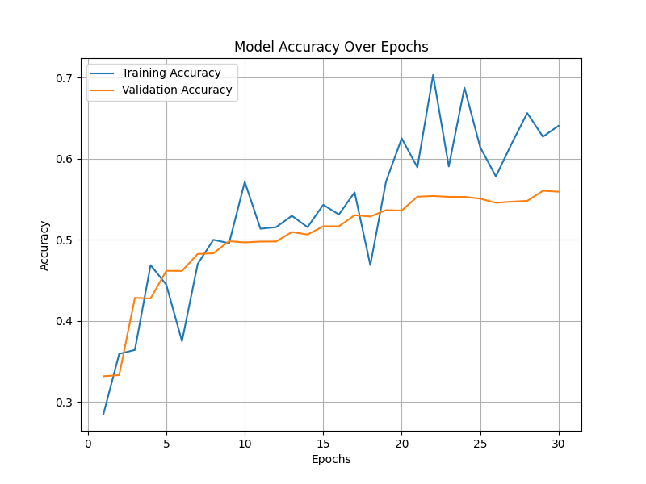

<<<<<<< HEAD
# Emotion Detection System

This project is a **Convolutional Neural Network (CNN) based Emotion Detection System** that can classify human emotions from images into 6 categories: **Happy, Sad, Angry, Surprised, Neutral, and Fear**.

## Model Performance

The model was trained on a dataset of **~24,590 images** and validated on **~6,347 images**.  
- **Training Accuracy:** 64%  
- **Validation Accuracy:** 55-56%  

### Accuracy Over Epochs
  
*Figure: Training vs Validation Accuracy over 30 epochs*

The plot above shows how the model accuracy improved during training.

## How to Use

1. Clone the repository:  
   ```bash
   git clone https://github.com/Yovinne-Shadora-data/emotion-detection-system.git
=======
# \# Emotion Detection System

# 

# An AI-powered system that detects human emotions from facial expressions using deep learning. This model is trained to classify six emotions: Happy, Sad, Angry, Surprised, Neutral, and Fear.

# 

# ---

# 

# \## Features

# 

# \- Real-time emotion detection using webcam input.

# \- Classifies six emotions accurately.

# \- Provides visualization of model training performance.

# \- Easy to use Flask web interface for testing.

# 

# ---

# 

# \## Dataset

# 

# The model was trained on a large dataset of \*\*24,590 images\*\* for training and \*\*6,347 images\*\* for validation, evenly distributed among the six classes.

# 

# ---

# 

# \## Model Accuracy

# 

# The plot below shows the training and validation accuracy of the model over 30 epochs.

# 

# !\[Model Accuracy](accuracy\_plot.png)

# 

# \- \*\*Final Training Accuracy:\*\* ~64.06%  

# \- \*\*Final Validation Accuracy:\*\* ~55.93%  

# 

# ---

# 

# \## Usage

# 

# 1\. Clone the repository:

# 

# ```bash

# git clone https://github.com/Yovinne-Shadora-data/emotion-detection-system.git

# cd emotion-detection-system

# 

>>>>>>> 5d5fd23 (Add model accuracy plot to README)
